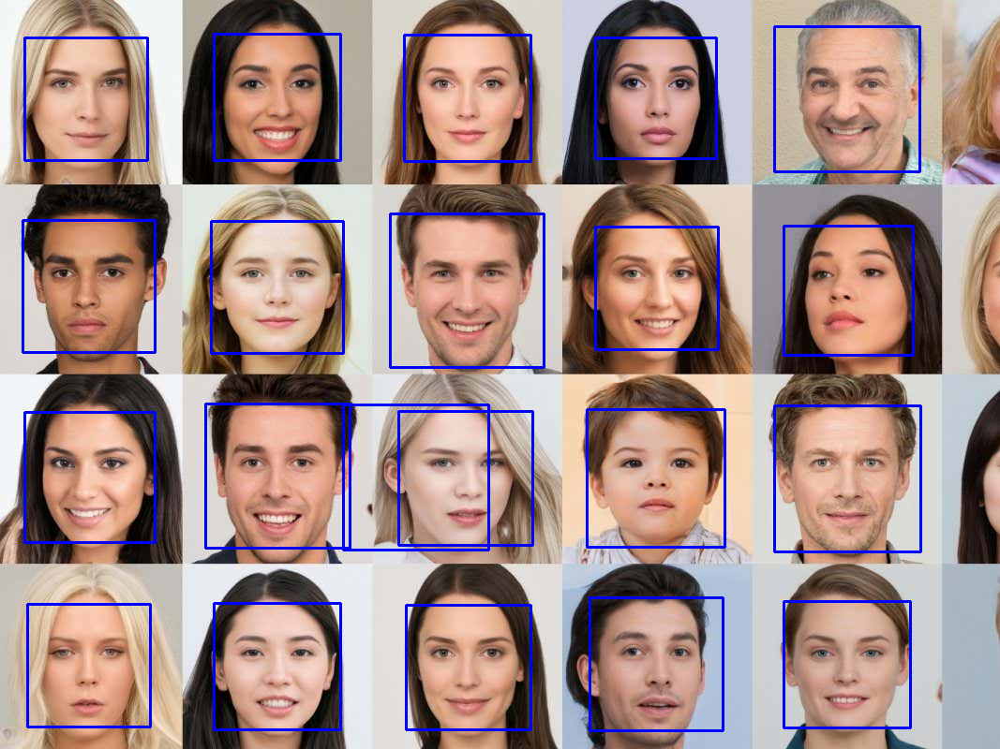
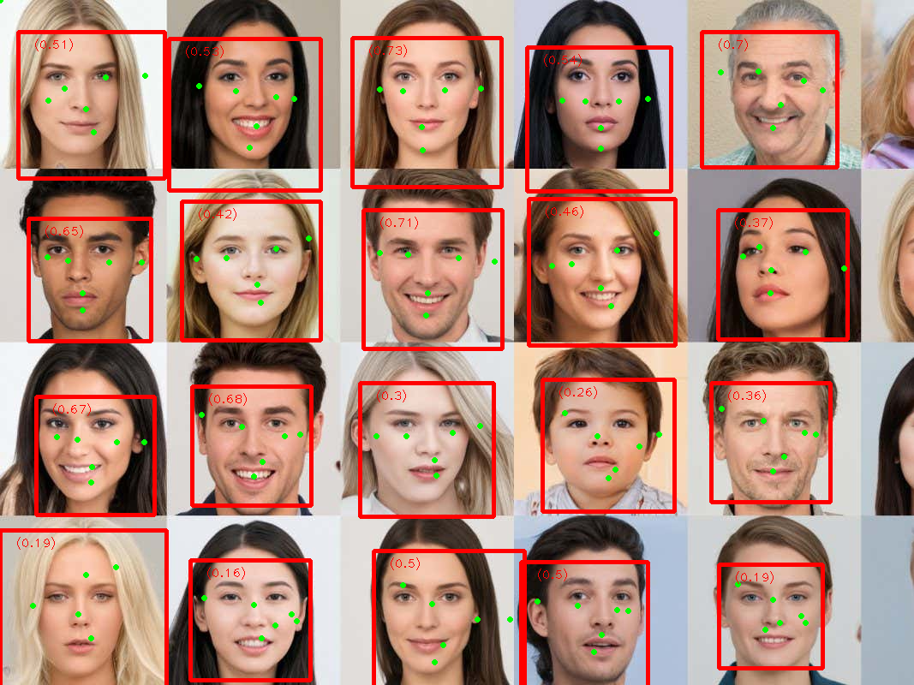

# face_detection_py
Face Detection using Python

## HAAR CASCADE
[OpenCV](https://docs.opencv.org/4.7.0/db/d28/tutorial_cascade_classifier.html)

## MEDIAPIPE
[API Python](https://developers.google.com/mediapipe/solutions/vision/face_detector/python)

